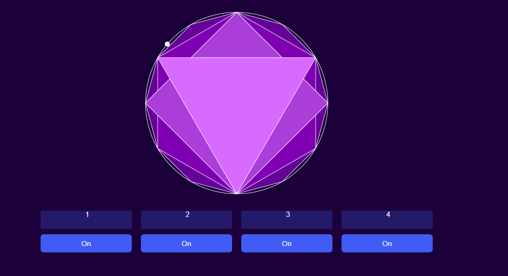

# Multimedia Interactiva

A collection of interactive multimedia experiments developed with **Processing and p5.js**, exploring the intersection between programming, mathematics, sound, interaction and generative visuals.

The project started with small experiments in procedural graphics and gradually evolved into more complex interactive systems involving webcams, game controllers, particle physics, audio and real-time visual feedback.

Each project explores a different way of turning user input into a visual or audiovisual experience.

---

## Projects

### 01 — Supershapes

A generative 3D animation based on mathematical supershapes.

The surface continuously morphs between different geometric configurations while changing its size, color and stroke. Its points are connected to a fixed spherical structure using curved Bézier lines, creating an organic effect reminiscent of a beating heart.

**Processing · 3D · Supershapes · Bézier curves · Generative animation**

[View project](./Entrega1)

[](https://youtu.be/eLHj4jlQABo)

[Watch the animation on YouTube](https://youtu.be/eLHj4jlQABo)

---

### R&D — p5.js Experiment

A smaller browser-based experiment created to explore **p5.js and interactive sound**.

Four buttons activate different polygons inside a circular interface. A moving particle travels around the circle, triggering a different musical note whenever it reaches a vertex of an active polygon.

Unlike the other projects, this experiment is already hosted online and can be played directly in the browser.

**p5.js · JavaScript · Web Audio · Procedural geometry**

[View project](./R&D)

[](https://eurong.github.io/Multimedia_Interactiva/R%26D/index.html)

[Open R&D in your browser](https://eurong.github.io/Multimedia_Interactiva/R%26D/index.html)

---

### 02 — Interactive Music

An interactive audiovisual instrument controlled through a webcam.

An 8 × 5 grid represents different instruments and notes. By moving an orange object in front of the camera, the program detects its position and triggers the corresponding sounds.

The music then drives the supershape from the first experiment, creating a direct connection between physical movement, sound and generative graphics.

**Processing · Computer vision · Webcam · Interactive music · Audio-reactive graphics**

[View project](./Entrega2)

[](https://youtu.be/y-kxAWK7cjM)

[Watch the animation on YouTube](https://youtu.be/y-kxAWK7cjM)

---

### 03 — Interactive Particle Painter

The main experiment of the collection.

Inspired by [Weave Silk](http://weavesilk.com), this project turns a game controller into a generative drawing instrument.

Particles are launched from the center of the screen with controllable direction and force, then influenced by a continuously changing Perlin noise flow field. Different particle behaviors, colors, sizes and forces can be combined to create complex and hypnotic patterns.

The system also includes audio-reactive particles and additional physics-based interactions.

**Processing · Particle physics · Perlin noise · Game controller · Generative art · Audio**

[View project](./Entrega3)

[](https://youtu.be/kZrV0znbqm8)

[Watch the animation on YouTube](https://youtu.be/kZrV0znbqm8)


---

## From Geometry to Interaction

The projects were developed progressively, with each experiment introducing a different aspect of interactive multimedia.

```text
        MATHEMATICS
             │
             ▼
       01 · SUPERSHAPES
       Procedural geometry
             │
             ▼
       02 · INTERACTIVE MUSIC
       Camera + sound
             │
             ▼
       03 · PARTICLE PAINTER
       Controller + physics
             │
             ▼
       R&D · P5.JS
       Browser + sound
```

What started as an exploration of mathematical shapes evolved into experiments where **movement, sound and user input become part of the visual system itself**.

---

## Technologies

The collection combines several technologies and concepts:

* **Processing**
* **p5.js**
* **JavaScript**
* **Java**
* **P3D**
* **PeasyCam**
* **Processing Sound**
* **Processing Video**
* **GameControlPlus**
* **G4P**
* **Perlin noise**
* **Particle systems**
* **3D procedural geometry**
* **Audio analysis**
* **Computer vision**
* **Game controller input**

---

## Concepts explored

Across the different experiments, the project explores:

* Generative art
* Procedural geometry
* Supershapes
* Particle physics
* Flow fields
* Bézier curves
* Real-time video processing
* Color detection
* Interactive music
* Audio-reactive graphics
* Game controller interaction
* Browser-based creative coding

---

## Repository Structure

```text
Multimedia_Interactiva/
│
├── Entrega 1/
│   └── Supershapes
│
├── Entrega 2/
│   └── Interactive Music
│
├── Entrega 3/
│   └── Interactive Particle Painter
│
└── R&D/
    └── p5.js sound experiment
```